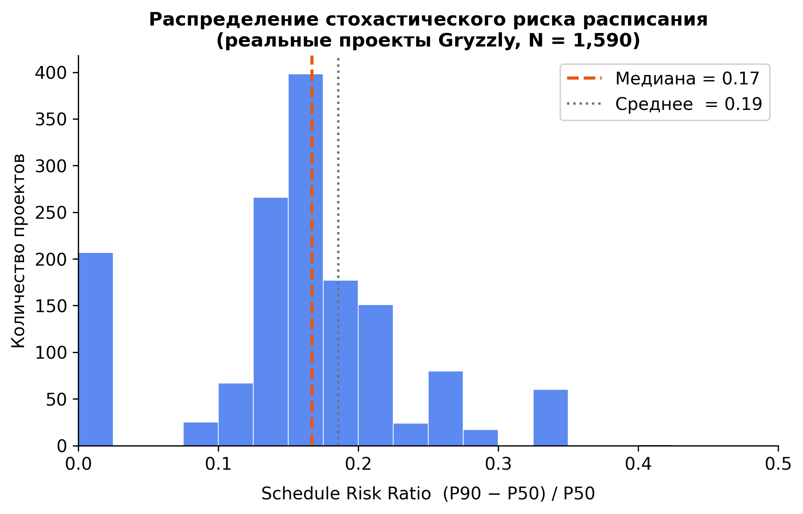
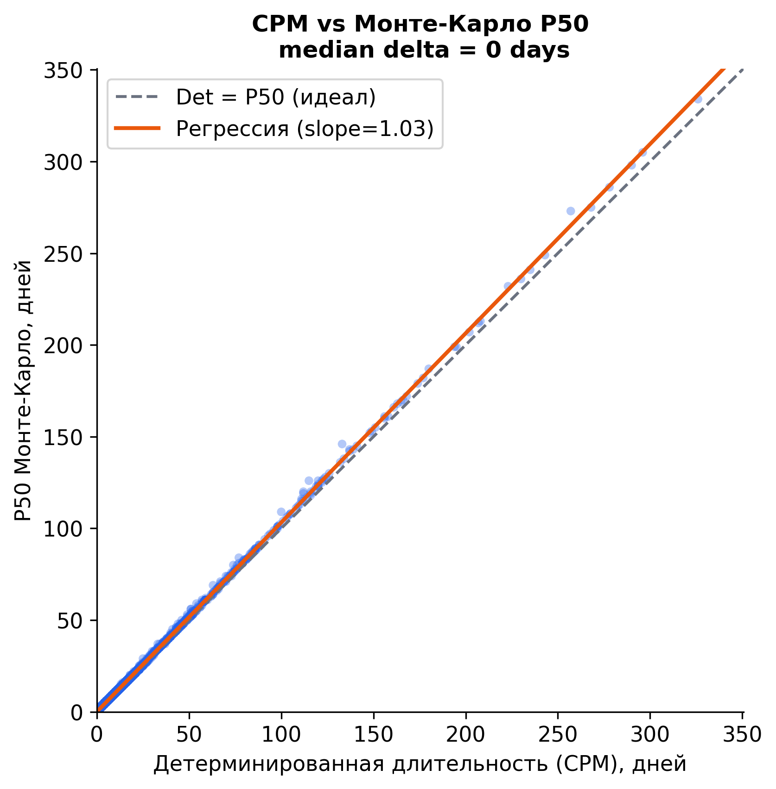
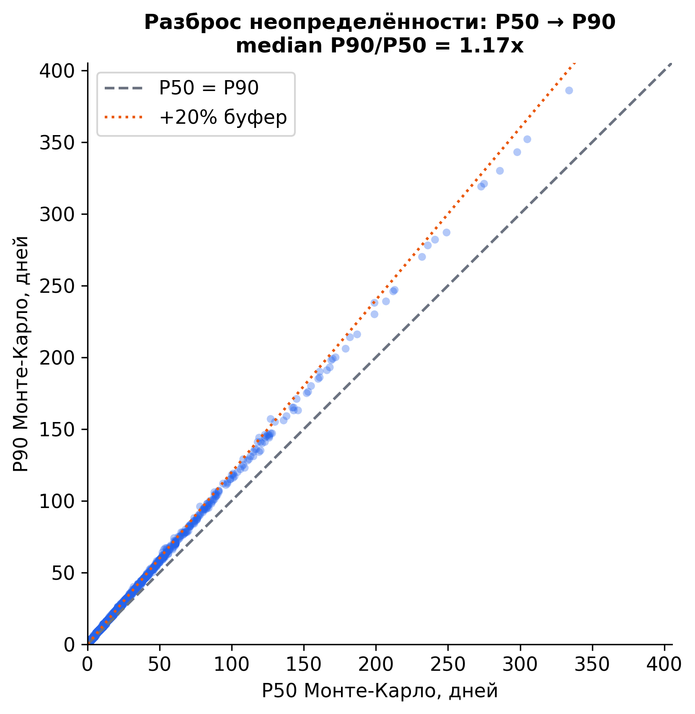
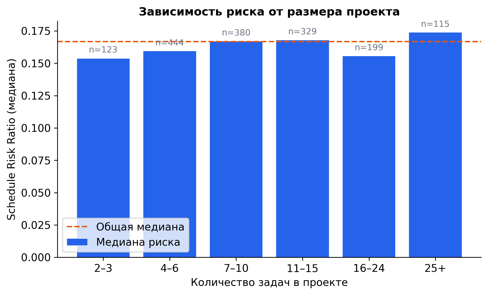
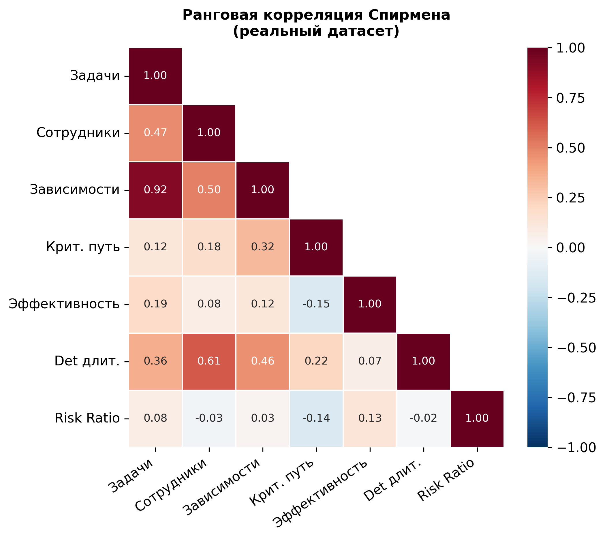

# Gryzzly Schedule Risk Analysis

Technical report on an unsuccessful attempt to validate a stochastic project scheduling model on real-world time-tracking data from the public [Gryzzly dataset](https://doi.org/10.1038/s41597-025-04903-2) (Abitbol & Arod, *Scientific Data*, 2025).

The experiment did not yield results suitable for the main research paper, but produced:

- A complete data processing and simulation pipeline (CPM + Monte Carlo on real project graphs)
- Clear empirical evidence of the limitations of project-level aggregate features for risk prediction
- Concrete lessons that motivated the subsequent shift to a synthetic-data approach

This repo is preserved as a standalone technical record. The main research paper uses synthetic data and references these findings as the motivation for that design choice.

---

## What this is

A pipeline that imports raw project-management CSVs, constructs task-dependency graphs, runs CPM and Monte Carlo simulation, and tests whether aggregate project features can predict two things:

1. The typical project duration (Monte Carlo P50)
2. The schedule reserve required for a pessimistic scenario — (P90 − P50) / P50

The answer to (1) is yes. The answer to (2) is essentially no, and that is the central result.

---

## Key findings

On **1 590 real projects** (filtered from 71 792 by data-quality criteria: elapsed/planned ratio ≤ 2×, 1–2 000 planned hours, ≥ 3 tasks and ≥ 3 dependencies), with **10 000 Monte Carlo iterations** per project:

| Metric | Value |
|---|---|
| Projects after filtering | 1 590 |
| CPM estimate, median | 12 days |
| P50 / P90, median | 12 / 16 days |
| Schedule reserve (P90 vs CPM) | **+31%** |
| CPM − P50 delta, median | 0 days |
| R² — duration prediction (RF, test set) | 0.327 |
| R² — reserve prediction (RF, test set) | **0.008** |

### The main negative result

**Aggregate project features cannot predict schedule reserve.** A Random Forest trained on `n_tasks`, `n_employees`, `n_dependencies`, `critical_path_tasks`, and `avg_employee_efficiency` achieves R² = 0.008 on the test set for predicting (P90 − P50) / P50. Five-fold cross-validation gives R² ≈ 0.04 — effectively zero. The same feature set explains duration moderately well (R² = 0.327 on test, ≈ 0.20 on CV), which confirms the problem is structural rather than a data issue.

The interpretation: aggregate features reflect project *scale*, but schedule reserve is driven by *topology* — the structure of the critical path and its sensitivity to task-level uncertainty. Two projects with identical aggregate statistics can have very different risk profiles depending on how their dependency graphs are shaped.

### Secondary findings

- **CPM ≈ P50.** The deterministic critical-path estimate coincides with the Monte Carlo median for 52% of projects (0-day difference). This is expected: the mean of the triangular distribution Triangular(0.15T, T, 1.73T) ≈ 0.96T, and by the Central Limit Theorem the sum along the critical path converges to the sum of means, which is approximately the CPM estimate.
- **The 31% reserve exists and is consistent.** P90 exceeds CPM by a median of 31%, concentrated in the 0.28–0.35 range. The reserve is real and non-trivial — it is simply not predictable from project-level aggregates.
- **R² for duration is inflated.** The `avg_employee_efficiency` feature is computed from the same task declarations as the target variable. Without it, R² for duration drops to ≈ 0.09, which means R² = 0.327 should be treated as an upper bound.

### Why this led to a synthetic approach

Real data constraints — no workload history per period, unresolvable confounding between efficiency and planning quality, inability to control topology — make it impossible to cleanly test the model on this dataset. The subsequent work uses synthetic projects with controlled graph structure, which is the only setup that allows fair attribution of risk to specific causal factors.

---

## Repo layout

```
gryzzly_dataset/
│
├── src/                         # Shared core library (language-independent)
│   ├── ltrroe_objects.py        # Data model: Project, Task, Employee, Dependency
│   └── algorithms.py            # CPM forward/backward pass, Monte Carlo simulation
│
├── pipeline/                    # English pipeline — run scripts in numbered order
│   ├── 1_import_data.py         # CSV → model objects (filtering + PERT calibration)
│   ├── 2_run_simulations.py     # Batch CPM + MC → outputs/metrics_results_full.csv
│   ├── 3_figures.py             # Figures A–F from metrics CSV
│   ├── 4_rf_duration.py         # Random Forest: predict deterministic duration
│   ├── 5_rf_risk.py             # Random Forest: predict schedule risk ratio
│   └── 6_efficiency_clusters.py # Efficiency-group boxplots
│
├── pipeline_ru/                 # Russian version of the pipeline (same logic)
│   ├── 1_import_data.py
│   ├── 2_run_simulations.py
│   ├── 3_rf_duration.py
│   ├── 4_rf_risk.py
│   ├── 5_efficiency_clusters.py
│   └── 6_visualisation.py
│
├── experiments/
│   └── empirical_triangle.py    # Sensitivity test: empirical PERT bounds
│                                # (calibrated from actual fact/plan ratios)
│
├── figures/                     # All output figures — flat, no nesting
│   ├── A_risk_distribution.png
│   ├── B_det_vs_p50.png
│   ├── C_p50_vs_p90.png
│   ├── D_risk_vs_size.png
│   ├── E_summary_table.png
│   ├── F_spearman_correlation.png
│   ├── rf_duration_actual_vs_predicted.png
│   ├── rf_duration_feature_importance.png
│   ├── rf_duration_error_distribution.png
│   ├── rf_risk_actual_vs_predicted.png
│   ├── rf_risk_feature_importance.png
│   └── rf_risk_error_distribution.png
│
├── data/                        # Raw Gryzzly CSVs — gitignored, see Data section
├── outputs/                     # Generated pickles and CSVs — gitignored
│
├── requirements.txt
├── LICENSE
└── README.md
```

---

## Pipeline

The scripts run in sequence. Each step produces a file that the next step consumes.

```
data/
  ├── users.csv
  ├── projects.csv
  ├── projects_computed.csv
  ├── tasks.csv
  ├── tasks_computed.csv
  └── declarations.csv
        │
        ▼
  pipeline/1_import_data.py
        │  Filters projects by quality criteria
        │  Builds PERT triplets per task (a=0.15m, m, b=1.70m)
        │  Computes employee efficiency proxy from declarations
        │
        ▼  outputs/ltrroe_real_projects.pkl
        │
  pipeline/2_run_simulations.py
        │  CPM forward/backward pass per project
        │  10 000 Monte Carlo iterations per project
        │  Outputs P10 / P50 / P90 / schedule_risk_ratio
        │
        ▼  outputs/metrics_results_full.csv
       ╱│╲
      ╱ │ ╲
     ▼  ▼  ▼
   3_   4_   5_
 figs  dur  risk
        RF models
```

### Step 1 — Import data

```bash
python pipeline/1_import_data.py
```

Reads the six CSVs from `data/`, applies filters, builds PERT duration triplets per task, computes `avg_employee_efficiency` (planned / elapsed ratio per primary assignee), and serialises all valid projects to `outputs/ltrroe_real_projects.pkl`.

### Step 2 — Run simulations

```bash
python pipeline/2_run_simulations.py
```

Loads the pickle, runs CPM + 10 000 MC iterations per project, and writes `outputs/metrics_results_full.csv` with columns: `n_tasks`, `n_employees`, `n_dependencies`, `det_duration_days`, `p10`, `p50`, `p90`, `schedule_risk_ratio`, `det_vs_p50_delta`, `critical_path_tasks`, `avg_employee_efficiency`.

### Step 3 — Generate figures

```bash
python pipeline/3_figures.py
```

Produces figures A–F in `figures/`:

| Figure | Description |
|---|---|
| A | Distribution of schedule risk ratio (P90−P50)/P50 |
| B | CPM duration vs Monte Carlo P50 (scatter + regression) |
| C | P50 vs P90 uncertainty spread |
| D | Median risk ratio by project size (task-count bins) |
| E | Summary statistics table |
| F | Spearman correlation matrix |

### Step 4 — ML experiments (optional)

```bash
python pipeline/4_rf_duration.py         # predict det_duration_days
python pipeline/5_rf_risk.py             # predict schedule_risk_ratio
python pipeline/6_efficiency_clusters.py # efficiency-group boxplots
```

### Sensitivity test

```bash
python experiments/empirical_triangle.py
```

Re-runs simulations with empirically calibrated PERT bounds (low=0.15×, high=1.70× from real fact/plan percentiles) instead of the default bounds. Outputs `dataset_test/metrics_empirical_triangle_clean_10000.csv` for comparison.

---

## Output figures

<table>
<tr>
<td><br><sub>A — Schedule risk ratio distribution</sub></td>
<td><br><sub>B — CPM vs Monte Carlo P50</sub></td>
</tr>
<tr>
<td><br><sub>C — P50 vs P90 spread</sub></td>
<td><br><sub>D — Risk by project size</sub></td>
</tr>
<tr>
<td><br><sub>F — Spearman correlation matrix</sub></td>
<td></td>
</tr>
</table>

---

## Data

The raw data is the **Gryzzly public dataset**:

> Abitbol, J.L., Arod, L. *Seven years of time-tracking data from a project management platform.* Scientific Data 12, 578 (2025). https://doi.org/10.1038/s41597-025-04903-2

The CSVs are not committed to this repo. Download from the link above and place under `data/` as:

```
data/users.csv
data/projects.csv
data/projects_computed.csv
data/tasks.csv
data/tasks_computed.csv
data/declarations.csv
```

---

## Setup

```bash
python -m venv .venv && source .venv/bin/activate
pip install -r requirements.txt
```

Python 3.10+.

---

## License

MIT — see [LICENSE](LICENSE).

The Gryzzly dataset is distributed under its own license; see the Scientific Data paper for terms.
