# Анализ календарного риска на данных Gryzzly

Технический отчёт о неудачной попытке валидировать стохастическую модель проектного планирования на реальных данных тайм-трекинга из публичного [датасета Gryzzly](https://doi.org/10.1038/s41597-025-04903-2) (Abitbol & Arod, *Scientific Data*, 2025).

Эксперимент не дал результатов, пригодных для основной научной статьи, но привёл к следующему:

- Полноценный пайплайн обработки данных и симуляции (CPM + Монте-Карло на реальных графах проектов)
- Чёткое эмпирическое подтверждение ограничений агрегированных признаков проекта для предсказания риска
- Конкретные выводы, которые обосновали последующий переход к синтетическим данным

Этот репозиторий сохранён как самостоятельный технический документ. Основная научная статья использует синтетические данные и ссылается на эти результаты как на обоснование такого выбора.

---

## Что это такое

Пайплайн, который импортирует «сырые» CSV с данными проектного управления, строит графы зависимостей задач, запускает CPM и симуляцию Монте-Карло, и проверяет, могут ли агрегированные признаки проекта предсказать две вещи:

1. Типичный срок проекта (медиана Монте-Карло, P50)
2. Резерв срока, необходимый для пессимистичного сценария — (P90 − P50) / P50

Ответ на (1) — да. Ответ на (2) — практически нет, и это главный результат.

---

## Ключевые результаты

На **1 590 реальных проектах** (отобрано из 71 792 по критериям качества данных: соотношение факт/план ≤ 2×, от 1 до 2 000 плановых часов, ≥ 3 задачи и ≥ 3 зависимости), с **10 000 итераций Монте-Карло** на проект:

| Показатель | Значение |
|---|---|
| Проектов после фильтрации | 1 590 |
| CPM-оценка, медиана | 12 дней |
| P50 / P90, медиана | 12 / 16 дней |
| Резерв срока (P90 к CPM) | **+31%** |
| Разница CPM − P50, медиана | 0 дней |
| R² — предсказание срока (RF, тест) | 0,327 |
| R² — предсказание резерва (RF, тест) | **0,008** |

### Главный отрицательный результат

**Агрегированные признаки проекта не позволяют предсказать резерв срока.** Случайный лес, обученный на `n_tasks`, `n_employees`, `n_dependencies`, `critical_path_tasks` и `avg_employee_efficiency`, даёт R² = 0,008 на тестовой выборке при предсказании (P90 − P50) / P50. 5-блочная кросс-валидация даёт R² ≈ 0,04 — фактически ноль. Тот же набор признаков умеренно хорошо объясняет срок (R² = 0,327 на тесте, ≈ 0,20 на CV), что подтверждает: проблема структурная, а не в данных.

Интерпретация: агрегированные признаки отражают *масштаб* проекта, но резерв срока определяется *топологией* — структурой критического пути и его чувствительностью к неопределённости на уровне отдельных задач. Два проекта с одинаковой агрегированной статистикой могут иметь совершенно разные профили риска в зависимости от формы их графа зависимостей.

### Второстепенные результаты

- **CPM ≈ P50.** Детерминированная оценка по методу критического пути совпадает с медианой Монте-Карло для 52% проектов (разница 0 дней). Это ожидаемо: среднее треугольного распределения Треуг(0,15T, T, 1,73T) ≈ 0,96T, и по центральной предельной теореме сумма по критическому пути сходится примерно к CPM-оценке.
- **Резерв в 31% реален и устойчив.** P90 превышает CPM-оценку в среднем на 31%, значения сосредоточены в диапазоне 0,28–0,35. Резерв реален и нетривиален — он просто не предсказывается по агрегированным признакам проекта.
- **R² для срока завышен.** Признак `avg_employee_efficiency` вычисляется из тех же деклараций задач, что и целевая переменная. Без него R² для срока падает до ≈ 0,09, поэтому R² = 0,327 следует считать верхней оценкой.

### Почему это привело к синтетическому подходу

Ограничения реальных данных — отсутствие истории загрузки по периодам, неразрешимая смешанность эффективности и качества планирования, невозможность контролировать топологию графа — делают невозможной чистую проверку модели на этом датасете. Дальнейшая работа использует синтетические проекты с контролируемой структурой графа — единственный способ корректно приписать риск конкретным причинным факторам.

---

## Структура репозитория

```
gryzzly-experiment/
│
├── ltrroe/                      # устанавливаемый пакет — pip install -e .
│   ├── core/
│   │   ├── objects.py           # модель данных: Project, Task, Employee, Dependency
│   │   └── algorithms.py        # прямой/обратный проход CPM, симуляция Монте-Карло
│   ├── pipeline/
│   │   ├── import_data.py       # CSV → объекты модели (фильтрация + калибровка PERT)
│   │   └── run_simulations.py   # пакетный CPM + MC → outputs/metrics_results_full.csv
│   ├── ml/
│   │   ├── rf_duration.py       # случайный лес: предсказание детерминированного срока
│   │   └── rf_risk.py           # случайный лес: предсказание резерва срока
│   ├── viz/
│   │   ├── figures.py           # основные графики A–F → figures/eng/ или figures/ru/
│   │   └── efficiency_clusters.py
│   └── experiments/
│       └── empirical_triangle.py   # проверка чувствительности: эмпирические границы PERT
│
├── figures/
│   ├── eng/                     # графики на английском (сохранены в репозитории)
│   └── ru/                      # графики на русском (сохранены в репозитории)
│
├── csvs/                        # «сырые» CSV Gryzzly — в .gitignore
├── outputs/                     # сгенерированные pickle и CSV — в .gitignore
│
├── Makefile                     # запуск пайплайна по порядку: make all
├── pyproject.toml
├── LICENSE
└── README.md
```

---

## Пайплайн

Скрипты запускаются последовательно. Каждый шаг производит файл, который потребляет следующий шаг.

```
csvs/
  ├── users.csv
  ├── projects.csv
  ├── projects_computed.csv
  ├── tasks.csv
  ├── tasks_computed.csv
  └── declarations.csv
        │
        ▼
  ltrroe.pipeline.import_data
        │  Фильтрует проекты по критериям качества
        │  Строит тройки PERT для каждой задачи (a=0,15m, m, b=1,70m)
        │  Вычисляет прокси-эффективность сотрудника по декларациям
        │
        ▼  outputs/ltrroe_real_projects.pkl
        │
  ltrroe.pipeline.run_simulations
        │  Прямой/обратный проход CPM по каждому проекту
        │  10 000 итераций Монте-Карло на проект
        │  Выдаёт P10 / P50 / P90 / schedule_risk_ratio
        │
        ▼  outputs/metrics_results_full.csv
       ╱│╲
      ╱ │ ╲
     ▼  ▼  ▼
  viz  ml   ml
 figs  dur  risk
```

### Шаг 1 — импорт данных

```bash
python -m ltrroe.pipeline.import_data
```

Читает шесть CSV из `csvs/`, применяет фильтры, строит тройки PERT для каждой задачи, вычисляет `avg_employee_efficiency` (отношение плановой к фактической длительности для основного исполнителя) и сериализует все валидные проекты в `outputs/ltrroe_real_projects.pkl`.

### Шаг 2 — запуск симуляций

```bash
python -m ltrroe.pipeline.run_simulations
```

Загружает pickle, запускает CPM + 10 000 итераций MC на проект и записывает `outputs/metrics_results_full.csv` со столбцами: `n_tasks`, `n_employees`, `n_dependencies`, `det_duration_days`, `p10`, `p50`, `p90`, `schedule_risk_ratio`, `det_vs_p50_delta`, `critical_path_tasks`, `avg_employee_efficiency`.

### Шаг 3 — генерация графиков

```bash
python -m ltrroe.viz.figures
```

Генерирует графики A–F в `figures/eng/` (или `figures/ru/`, в зависимости от языка вывода):

| График | Описание |
|---|---|
| A | Распределение относительного резерва срока (P90−P50)/P50 |
| B | CPM-срок против медианы Монте-Карло (диаграмма рассеяния + регрессия) |
| C | Разброс неопределённости P50 к P90 |
| D | Медианный резерв по размеру проекта (бины по числу задач) |
| F | Корреляционная матрица Спирмена |

### Шаг 4 — ML-эксперименты (опционально)

```bash
python -m ltrroe.ml.rf_duration
python -m ltrroe.ml.rf_risk
python -m ltrroe.viz.efficiency_clusters
```

### Проверка чувствительности

```bash
python -m ltrroe.experiments.empirical_triangle
```

Повторяет симуляции с эмпирически откалиброванными границами PERT (low=0,15×, high=1,70× от реальных перцентилей факт/план) вместо границ по умолчанию. Результат — `outputs/metrics_empirical_triangle_clean_10000.csv` для сравнения.

---

## Графики

### Основной анализ

<table>
<tr>
<td>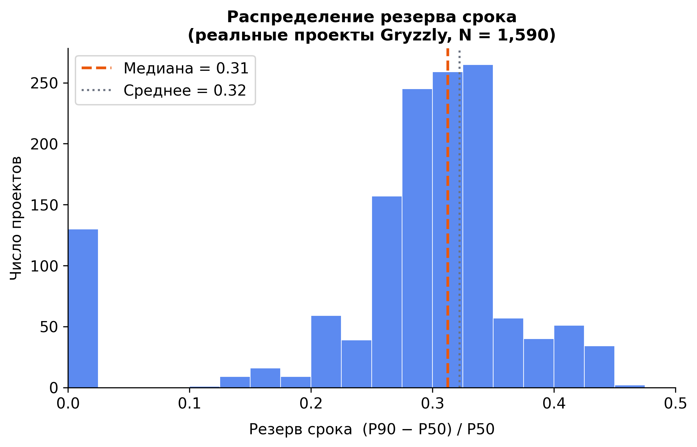<br><sub>A — Распределение резерва срока</sub></td>
<td>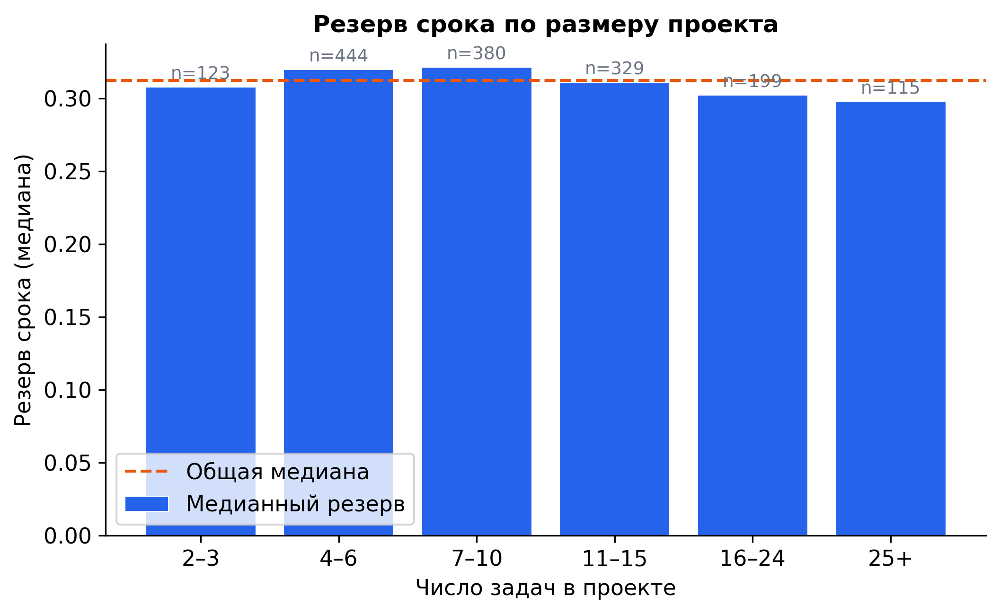<br><sub>D — Резерв по размеру проекта</sub></td>
</tr>
<tr>
<td>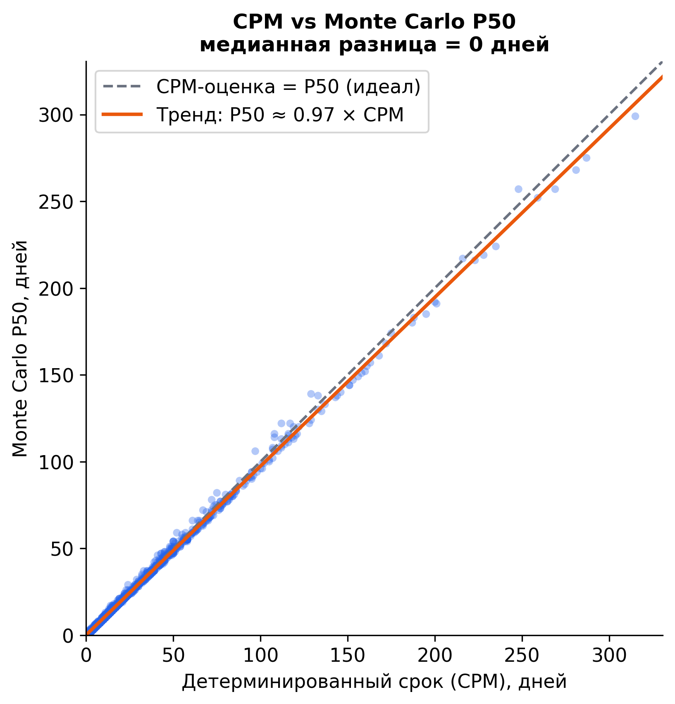<br><sub>B — CPM против медианы Монте-Карло</sub></td>
<td>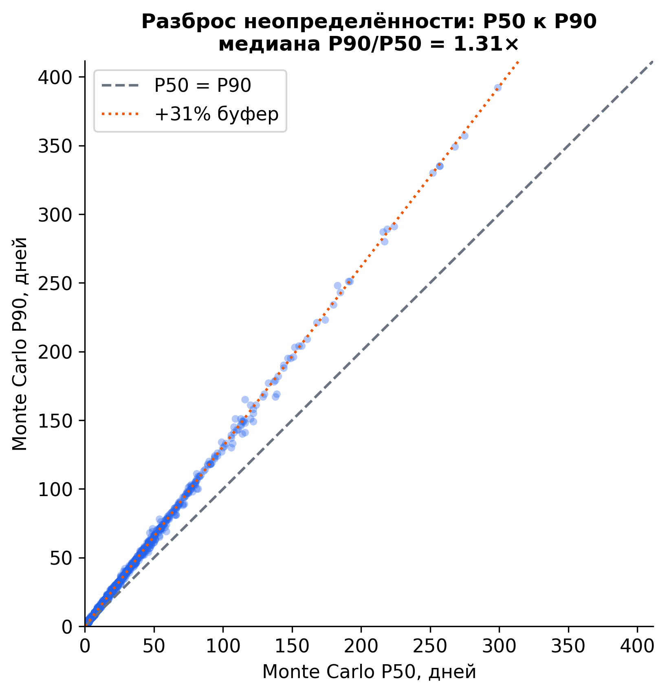<br><sub>C — Разброс P50 к P90</sub></td>
</tr>
<tr>
<td>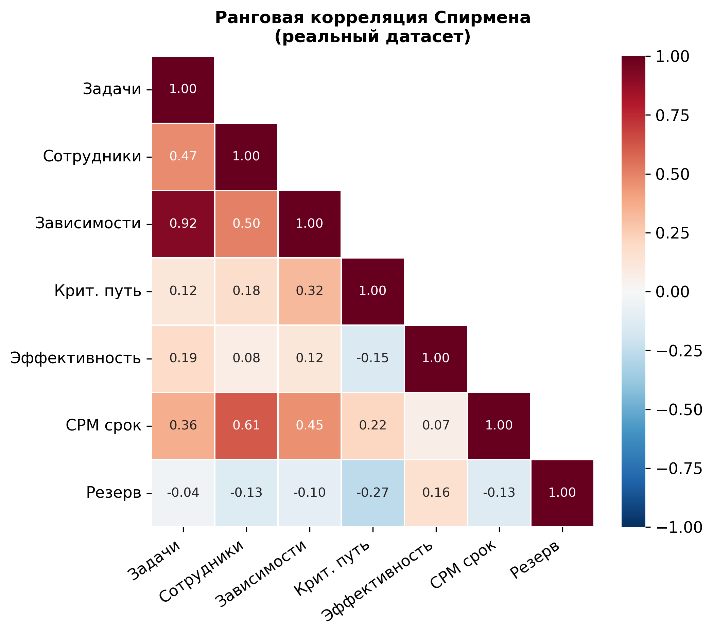<br><sub>F — Корреляционная матрица Спирмена</sub></td>
</tr>
</table>

### Диагностика случайного леса

<table>
<tr>
<td>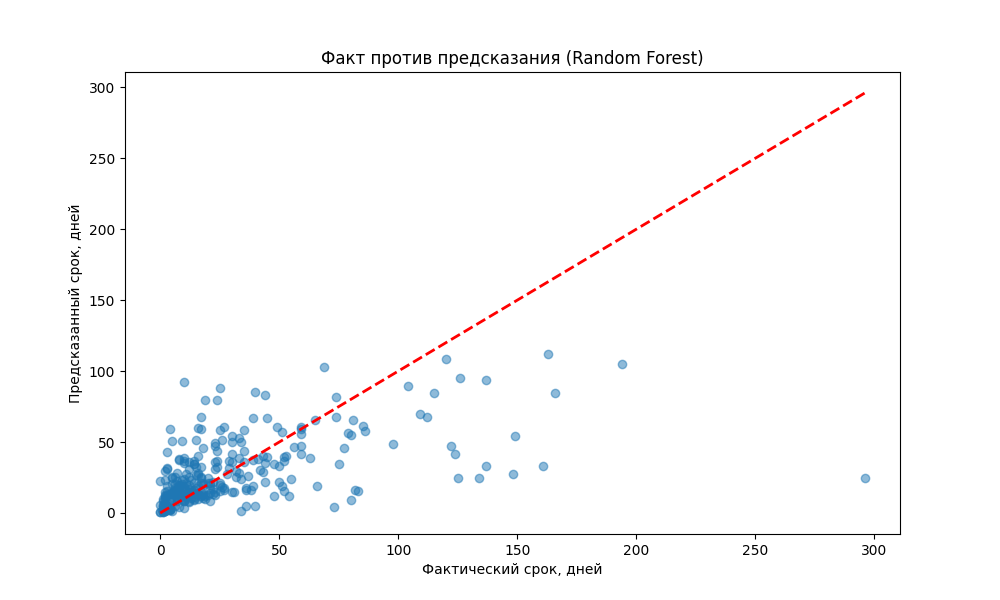<br><sub>Срок — факт против предсказания</sub></td>
<td>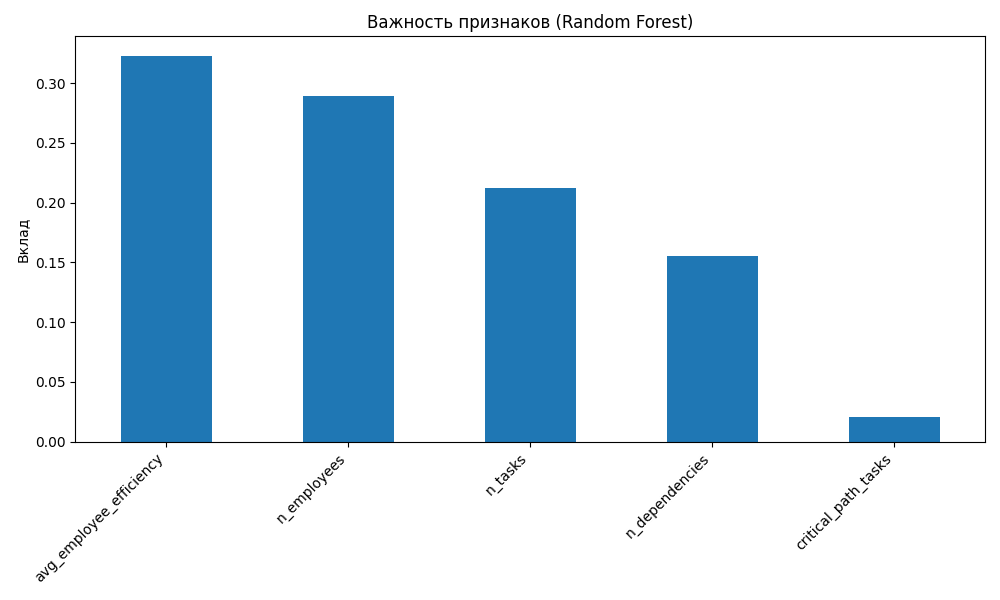<br><sub>Срок — важность признаков</sub></td>
<td>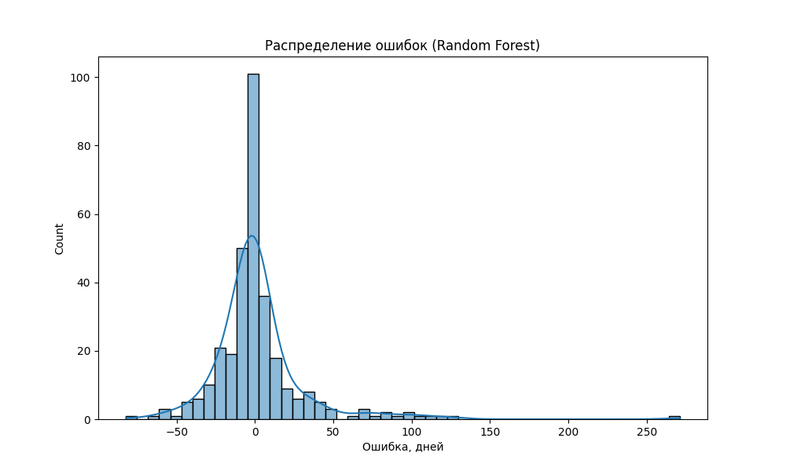<br><sub>Срок — распределение ошибок</sub></td>
</tr>
<tr>
<td>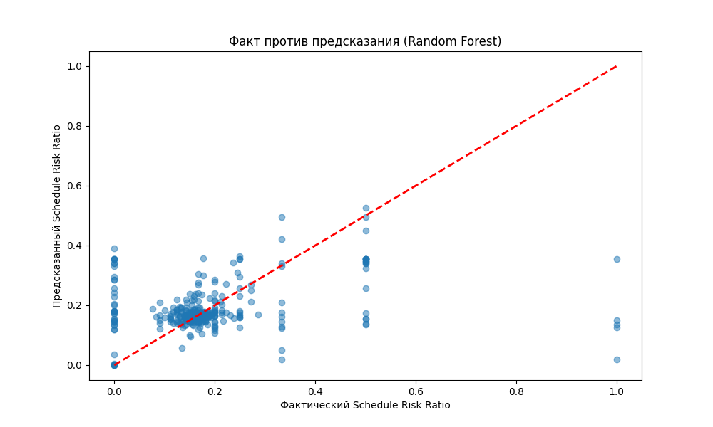<br><sub>Резерв — факт против предсказания</sub></td>
<td>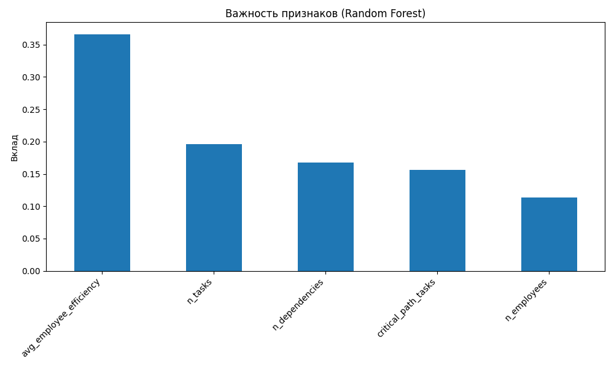<br><sub>Резерв — важность признаков</sub></td>
<td>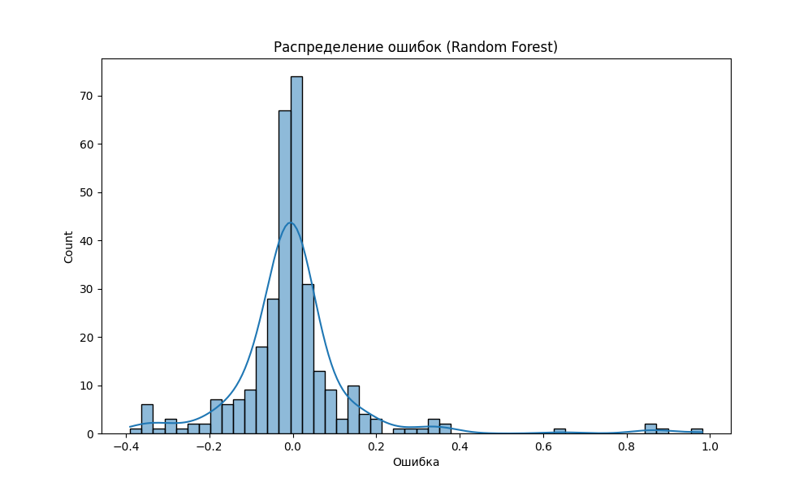<br><sub>Резерв — распределение ошибок</sub></td>
</tr>
</table>

---

## Данные

Исходные данные — **публичный датасет Gryzzly**:

> Abitbol, J.L., Arod, L. *Seven years of time-tracking data from a project management platform.* Scientific Data 12, 578 (2025). https://doi.org/10.1038/s41597-025-04903-2

---

## Установка

```bash
python -m venv .venv && source .venv/bin/activate
pip install -e .
```

Требуется Python 3.10+.

---

## Лицензия

MIT — см. [LICENSE](LICENSE).

Датасет Gryzzly распространяется на собственных условиях лицензирования; см. статью в Scientific Data.
